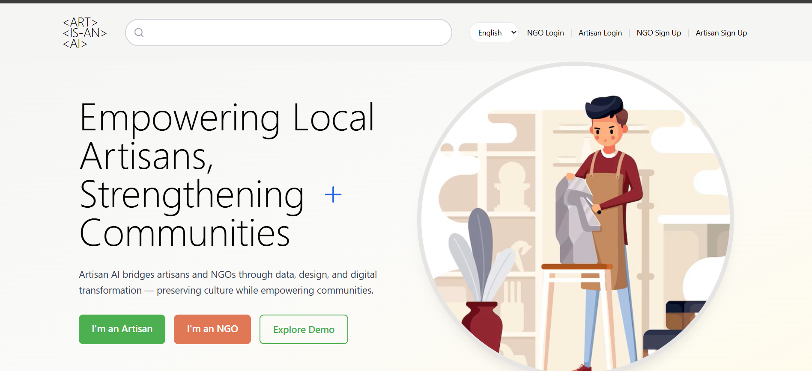
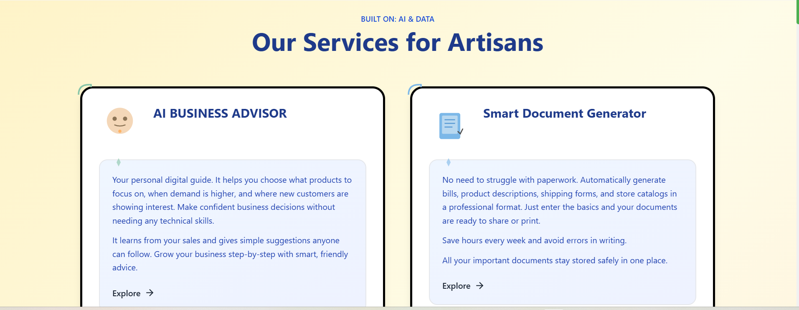
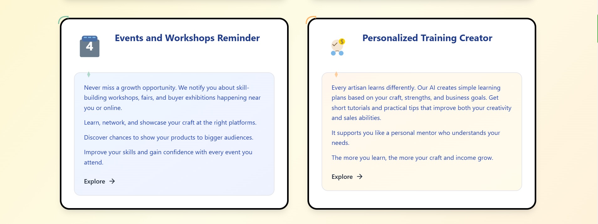
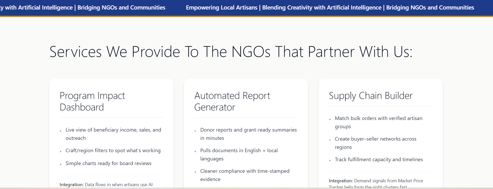
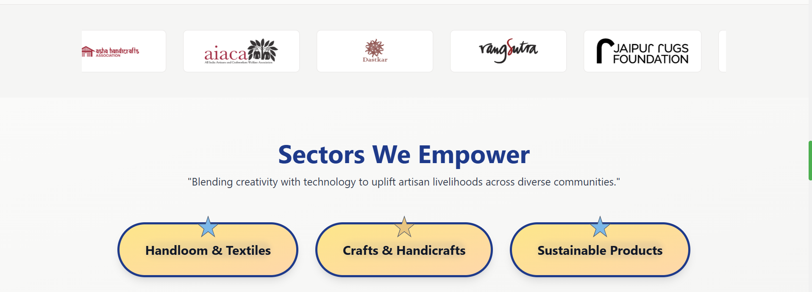
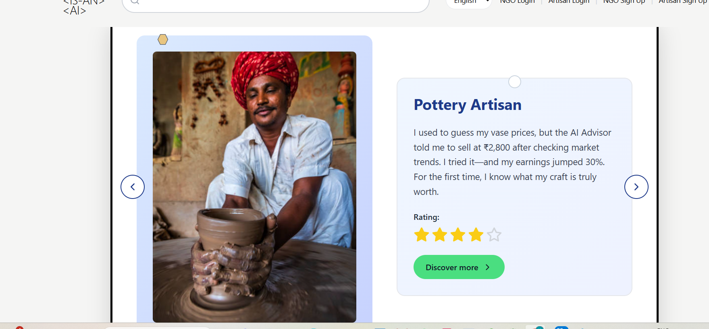
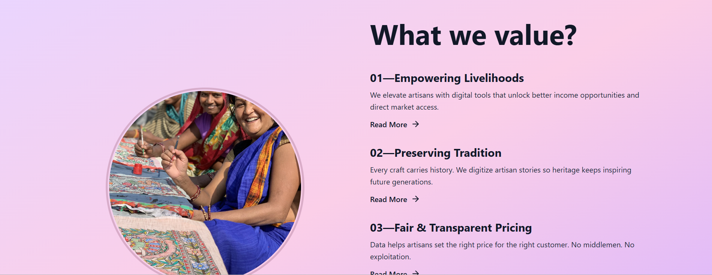
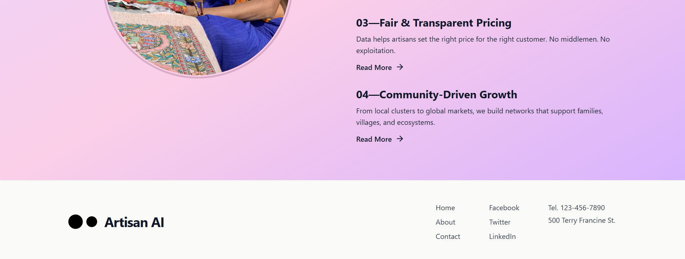

# Artisan AI 🎨

Artisan AI is a role-based web platform designed to support artisan communities and NGOs through AI-assisted tools, insights, and digital workflows. It provides two dedicated experiences:
- **Artisan Portal** for business guidance, pricing visibility, training, and documentation.
- **NGO Portal** for impact monitoring, quality oversight, and ecosystem support.

The frontend is built as a modern, responsive React + TypeScript application with multilingual support and a visual style tailored to craft-focused storytelling.

## Problem It Solves

Artisans often face limited market access, uncertain pricing, and low digital visibility. NGOs need better visibility into impact and operations.
Artisan AI bridges this gap by combining:
- accessible digital tools for artisans,
- data-driven dashboards for NGOs,
- and a shared interface that improves coordination across stakeholders.

## Core Features

### Artisan Experience
- AI Advisor chat interface
- Market price tracking and trend visibility
- Skill training modules
- Quality assessment workflows
- Events and opportunities listing
- Document support and generation

### NGO Experience
- Impact dashboard and metrics
- Market intelligence view
- Training and quality supervision workflows
- Supply-chain collaboration screens
- Reporting-oriented views

## Tech Stack

- React 18 + TypeScript
- Vite + Tailwind CSS
- React Router
- Zustand state management
- Recharts for visual analytics
- Framer Motion for UI interactions

## Getting Started

### Prerequisites
- Node.js 18+
- npm

### Run Frontend

```bash
cd project
npm install
npm run dev
```

Open: `http://localhost:5173`

### Build Frontend

```bash
cd project
npm run build
```

## Project Structure (Frontend)

```text
project/
├── src/
│   ├── components/
│   ├── pages/
│   │   ├── artisan/
│   │   └── ngo/
│   ├── store/
│   ├── modules/
│   └── utils/
├── public/
└── README.md
```

## Screenshots (SS)

### Home & Navigation



### Artisan Experience



### NGO Experience



### Additional Views



## Notes

- Current implementation uses mock/demo data.
- Architecture is ready for backend/API integration.
- Designed for accessibility and mobile responsiveness.

---

Built for artisan empowerment and NGO collaboration.

